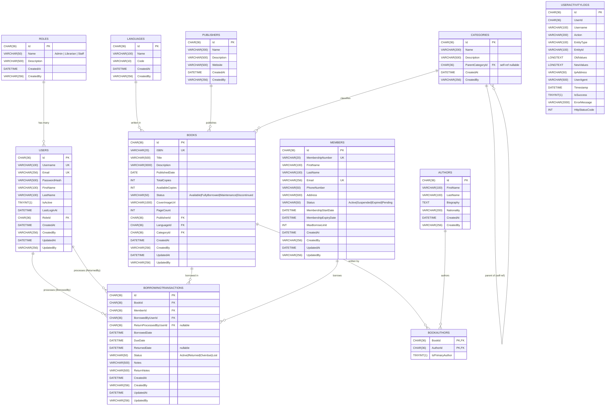

# Entity Relationship Diagram — Library Management System

## ERD (Mermaid)



---

## Relationships Summary

| Relationship | Type | Description |
|---|---|---|
| Role → Users | One-to-Many | A role can have many users |
| User → BorrowingTransactions | One-to-Many | A user (staff) processes borrowings |
| Language → Books | One-to-Many | A language is used by many books |
| Publisher → Books | One-to-Many | A publisher publishes many books |
| Category → Books | One-to-Many | A category classifies many books |
| Category → Category | Self One-to-Many | Hierarchical tree (Fiction → Mystery) |
| Book → BookAuthors | One-to-Many | A book can have multiple authors |
| Author → BookAuthors | One-to-Many | An author can write multiple books |
| Book ↔ Author | Many-to-Many | Via BookAuthors join table with IsPrimaryAuthor flag |
| Member → BorrowingTransactions | One-to-Many | A member can borrow many books |
| Book → BorrowingTransactions | One-to-Many | A book can be borrowed many times |

---

## Category Hierarchy (Tree)

```
Fiction
├── Mystery
├── Thriller
└── Science Fiction

Non-Fiction
└── Technology
    ├── Programming
    └── Web Development

Science
├── Biology
└── Physics
```

---

## Key Indexes

| Table | Index | Purpose |
|---|---|---|
| Books | ISBN (UNIQUE) | Fast lookup + duplicate prevention |
| Books | Title | Search queries |
| Books | Status | Filter by availability |
| Books | CategoryId | Filter by category |
| Members | MembershipNumber (UNIQUE) | Fast member lookup |
| Members | Email (UNIQUE) | Duplicate email prevention |
| BorrowingTransactions | (BookId, MemberId, Status) | Prevent double-borrowing |
| BorrowingTransactions | MemberId | Member history queries |
| BorrowingTransactions | DueDate | Overdue detection |
| UserActivityLogs | UserId | User audit trail |
| UserActivityLogs | Timestamp | Time-based log queries |
| Users | Username (UNIQUE) | Auth lookup |
| Users | Email (UNIQUE) | Auth lookup |
